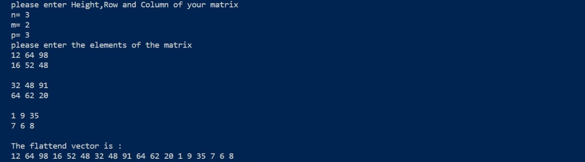
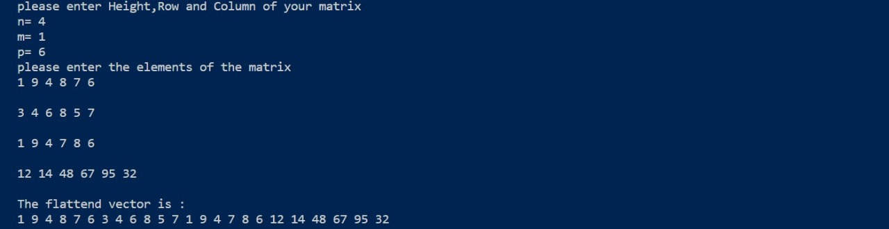
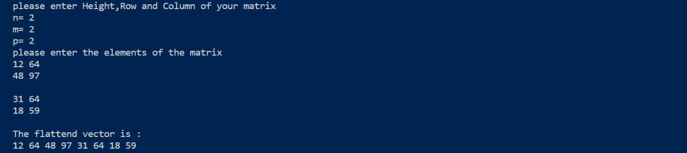
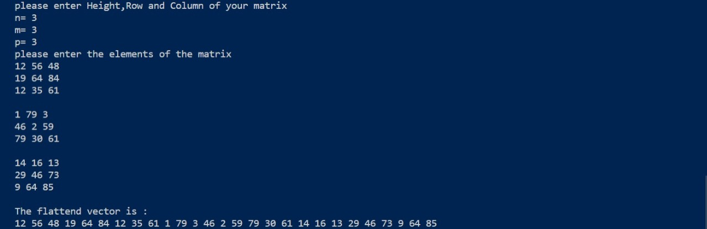

<div align="center">

# Matrix Flatten

 
 
</div>

## 📙 About
* A 3D matrix is to be stored in a 1D vector (flattened).
## 📝 Description
* Convert the 3D matrix index (i, j, k) to a suitable 1D vector index (y). Must be O(1).

## 🏁 Getting Started

## Complexity

- The complexity of indexing from i, j, k to index "y" is **O(1)**
- The indexing formula for the conversion from 3D element position to 1D is index "y" = (i * m * p) + (j * p) + k
- The complexity of looping through the 3D vector is **O(n\*m\*p)** = **O(size)** where size is the number of 
  elements in the vector which is equal to n * m * p

## Dependencies

* C++

## 💻 Installing

```
git clone https://github.com/AbdelrahmanNoaman/Matrix-Flatten
```

```
g++ Matrix_Flatten.cpp
```

```
./a.out
```

### 📷 Screenshots


#### Convert 3D matrix into 1D vector using the formula y = i * m * p + j * p + k


#### Test random cases





## Contributors

<table>
<tr>
<td align="center">
<a href="https://github.com/AbdelrahmanNoaman" target="_blank">
<br /><sub><b>Abdelrahman Noaman</b></sub></a><br />
</td>
</tr>
 </table>

## License

This project is licensed under the [MIT] License - see the [LICENSE.md](LICENSE) file for details